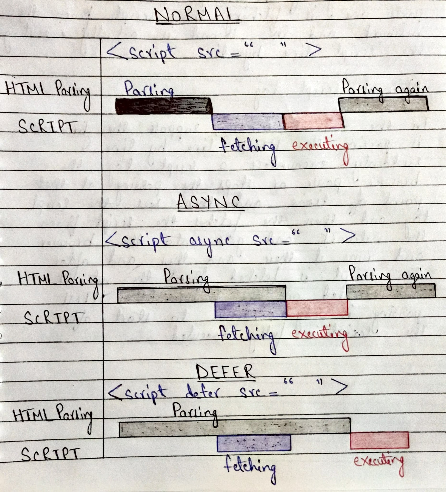

# _Namaste React Assignments_

## `Episode 1 - Inception`

## 1. What is `Emmet` ?

- `Emmet` is a free `add-on` for our text editor. It allows us to type shortcuts that are then expanded into full pieces of code.

- By using `Emmet`, developers type less, they save both on `keystrokes` and `time`.

## 2. Difference between a `Library` and `Framework` ?

- `Library` is like building your home from the `ground up`. The house can be made in any style you prefer and the rooms can be arranged and decorated however you like. 

- `Framework`, on the other hand, is like buying a `new home`. The house is already built, so you don’t have to worry about building problems, but you can’t choose how the rooms are arranged.

- By using a `library`, you `control the flow of the program`. The `library` can be invoked whenever and wherever you like. Contrary to this, when you use a `framework`, the `flow is controlled by the framework`. The `framework` instructs you where to put your code, but it will call your code as required.

## 3. What is `CDN` ? Why do we use it ?

- `Content Delivery Network (CDN)` refers to a geographically distributed group of servers that work together to provide fast delivery of Internet content.

- The main use of a `CDN` is to deliver content through a `network of servers` in a `secure` and `efficient` way.

## 4. Why is `React` known as `React` ?

- `React` is named `React` because of its ability to react to changes in data. `React` is called `React` because it was designed to be a `declarative`, `efficient`, and `flexible JavaScript library` for building user interfaces. 

- The name `React` was chosen because the `library` was designed to allow developers to `"react"` to changes in state and data within an application, and to update the user interface in a `declarative` and `efficient` manner.

- `React` is a JavaScript-based UI development library.

- `Facebook` and `Open-source community` runs it.

## 5. What is cross-origin in the script tag ?

- The `cross-origin` attribute sets the mode of the requests to an `HTTP CORS Request`.

- The purpose of `cross-origin` attribute is used to share the resources from one domain to another domain.

- Basically, it is used to handle the `CORS` request.

- It is used to handle the `CORS` request that checks whether it is safe to allow for sharing the resources from other domains.

### Syntax

```sh
<script crossorigin src="..."></script>
```

## 6. What is the difference between `React` and `ReactDOM` ?

- `React` is a JavaScript libarary for building `user interfaces` whereas `ReactDOM` is also JavaScript library that allows `React to interact with DOM`.

- The `React` package contains `React.createElement()`, `React.Component`, `React.Children` and other helpers related to elements and component classes.

- The `ReactDOM` package conatins `ReactDOM.render()`, etc.

## 7. What is the difference between `react.development.js` and `react.production.js` files via `CDN` ?

- `Development` is the stage of an application before it's made public while `production` is the term used for the same application when it's made public.

- `Development build` is several times (maybe 3-5x) `slower` than the `production build`.


## 8. What are `async` and `defer` ?

- `async` and `defer` are `boolean attributes` which are used along with the `script` tags to load the external scripts efficiently into our webpage.

- `async` attribute does not guarantee the order of execution of scripts whereas `defer` attribute maintains the order of execution of scripts.

### Syntax

```sh
<script async src="..."> 
```

```sh
<script defer src="...">
```




